# 统一生成式感知框架技术方案

状态：v1 架构与工程配置已落地，完整训练/推理闭环待实现  
阶段范围：语义分割、单目深度、表面法线  
参考：`生成模型感知任务能力研究考核方案 (2).docx`、`MarigoldSemanticSegmentation/`

## 1. 目标与边界

本方案将第一阶段的三类感知任务统一为一个条件扩散问题：给定 RGB 图像、扩散时间步和任务标识，使用同一个 Stable Diffusion 2 U-Net 预测带噪目标 latent 中的噪声，再由任务 codec 解码为分割、深度或法线结果。

v1 必须满足以下不变量：

1. 只有一个共享 U-Net 和一套训练/推理循环，不为任务复制 trainer 或 pipeline。
2. 每个样本必须携带显式 `task_name`；模型不能依赖空文本隐式猜测任务。
3. 任务 token 和可选文本 token 统一组成 `encoder_hidden_states`，通过 U-Net 各尺度 cross-attention 注入。
4. 任务差异只允许存在于 `TargetCodec`、数据适配器、评测器、可视化器和轻量任务 adapter 中。
5. 第一阶段冻结 VAE、文本编码器以及 U-Net 的非 cross-attention 主体，仅训练输入卷积、cross-attention、任务 token 和任务 adapter。
6. 分割候选类别不得来自当前样本的 GT 标签，避免评测泄漏。

暂不在 v1 中解决检测、分类、光流、少步蒸馏和开放世界类别检索；这些能力通过扩展 `TaskSpec` 和 adapter 策略进入后续阶段，而不改变共享训练主循环。

## 2. 参考代码结论

### 2.1 可以复用的机制

参考仓库的深度、法线和分割实现具有相同的扩散主干：

- RGB 和任务目标都通过 SD VAE 映射到 latent 空间；
- 将 `image_latent` 与 `noisy_target_latent` 按通道拼接；
- 将预训练 U-Net 的输入从 4 通道扩展到 8 通道；
- 使用 DDPM/DDIM 和退火多尺度噪声完成训练与采样；
- 任务输出在 VAE 解码后进入各自后处理与评测协议。

这些共性说明三条独立 pipeline 可以重构为一个 `UnifiedPerceptionDenoiser`。

### 2.2 必须修正的问题

1. 深度和法线都使用空文本条件。若合并为单一权重，模型没有可靠信号区分任务。
	我觉得可以利用一个task token做信号区分，这里可以给我一点参考和示例可能解决方法
2. 三套训练/推理代码高度重复，注册入口也不完整，后续修复容易发生行为漂移。
	这里进行代码重构和对齐，保证可以跑通和实现
3. 分割参考实现按当前样本 GT 中出现的类别生成查询，属于 GT 信息泄漏；统一框架必须从数据集词表、用户文本或独立候选生成器获得类别。
	这里是不是需要根据数据集的测评来？如果是的就按照任务考核中推荐数据集实现
4. 分割二值掩码的训练输入范围与推理解码假设不一致。所有输入 VAE 的目标都必须显式归一化到约定范围。
	这里是不是有task codec决定？ 如果是我们可以探讨一下使用一个可学习如cnn来把图像的通道展开到一个统一的标准再送入vae
5. 参考代码包含硬编码路径和设备编号。统一框架只允许从配置和环境变量读取数据、模型和输出位置。
	修改成支持配置文件的工程化项目

## 3. 方案比较与推荐

| 方案 | 机制 | 优点 | 主要风险 | 定位 |
| --- | --- | --- | --- | --- |
| A. 完全共享 + 单任务 token | 一个 U-Net，仅用任务 token 区分任务 | 最简单、参数最少 | 任务容量不足，负迁移难隔离 | 低风险回退与消融基线 |
| B. 共享 U-Net + 任务 token + 条件 adapter | 每任务 adapter 变换任务 token，可选文本 token 随后拼接，再经所有 cross-attention 注入 | 保持单骨干，任务隔离清晰，参数量小 | adapter 仅在条件空间，复杂任务可能容量不足 | **v1 推荐并已落地骨架** |
| C. 共享 U-Net + 每任务 attention processor/LoRA | 在各尺度 cross-attention 中增加任务专属低秩分支 | 容量更强、定位到层 | 工程复杂，参数管理和 checkpoint 兼容成本更高 | v2 负迁移补救方案 |
| D. 每任务独立 U-Net | 三套模型分别训练 | 最容易复现单任务上限 | 不满足统一骨干目标，存储与维护成本高 | 仅作单任务上界基线 |

推荐先执行 B。若多任务相对单任务基线出现稳定且显著的退化，再用 C 做有证据的升级；不在没有负迁移证据时提前引入多套 LoRA 或专家路由。

## 4. 总体架构

```mermaid
flowchart LR
    RGB["RGB image"] --> IVAE["Frozen SD2 VAE encoder"]
    IVAE --> ZI["image_latent z_img"]

    TARGET["task target"] --> CODEC["Deterministic TargetCodec"]
    CODEC --> TADAPT["Optional task-specific pre-VAE CNN"]
    TADAPT --> TVAE["Frozen SD2 VAE encoder"]
    TVAE --> Z0["clean target latent z_0"]
    Z0 --> NOISE["Noise scheduler"]
    NOISE --> ZT["noisy target latent z_t"]

    TASK["task_name"] --> TOKENS["Learned task tokens"]
    TOKENS --> ADAPTER["Task-specific residual adapter"]
    TEXT["optional text prompt"] --> CLIP["Frozen CLIP text encoder"]
    CLIP --> CONCATCOND["condition token concat"]
    ADAPTER --> CONCATCOND

    ZI --> CONCATLATENT["channel concat: 4 + 4"]
    ZT --> CONCATLATENT
    CONCATLATENT --> UNET["One shared SD2 U-Net"]
    CONCATCOND -->|"cross-attention at all scales"| UNET
    UNET --> EPS["predicted noise"]
    EPS --> LOSS["masked diffusion MSE"]
    EPS --> SAMPLER["DDIM/DDPM sampling"]
    SAMPLER --> DVAE["Frozen SD2 VAE decoder"]
    DVAE --> DECODE["Task-specific decode/postprocess"]
    DECODE --> METRIC["Task-specific evaluator"]
```



核心前向公式为：

```text
c_task = Adapter_task(TaskEmbedding(task_name))
c = concat(c_task, Project(CLIP(text)))              # text 可选
z_t = alpha_t * z_0 + sigma_t * epsilon
epsilon_hat = SharedUNet(concat(z_img, z_t), t, c)
loss = masked_mse(epsilon_hat, epsilon)
```

任务 adapter 当前放在条件 token 空间。经 adapter 处理后的 token 作为 `encoder_hidden_states` 输入，因此会被同一 U-Net 的 down/mid/up 多尺度 cross-attention 消费；并不是只在入口注入一次后丢失任务信息。

### 4.1 Task token 参考实现

假设 `num_task_tokens=4`、SD2 的 `cross_attention_dim=1024`。每个任务拥有 4 个可学习 token，而不是所有任务共享一个向量：

```python
conditioner = TaskTokenConditioner(
    task_names=["segmentation", "depth", "normal"],
    cross_attention_dim=1024,
    num_task_tokens=4,
    adapter_bottleneck_dim=256,
    text_input_dim=1024,
)

# 深度 batch: [B,4,1024]
depth_condition = conditioner("depth", batch_size=batch_size)

# 开放词表分割可追加 77 个 CLIP token: [B,4+77,1024]
seg_condition = conditioner(
    "segmentation",
    batch_size=batch_size,
    text_hidden_states=clip_hidden_states,
)

output = denoiser(
    image_latent,
    noisy_target_latent,
    timesteps,
    task_names="depth",
)
```

如果希望严格使用“一个 task token”，将 `num_task_tokens` 设为 1 即可，此时每个任务条件形状为 `[B,1,1024]`。默认使用 4 个 token 是为了给任务条件更多容量，并不改变接口；应把 1/4/8 token 做成参数量和效果消融。

任务 ID 首先索引独立的 token 组，再经过对应 `ResidualConditionAdapter`。深度和法线即使都没有文本，其条件状态也不同。训练时需要加入两个机械验证：固定图像和噪声，仅交换 task token 时输出应变化；把 task token 全部置零时，多任务性能应明显受损，否则说明模型没有使用任务信号。

## 5. 模块与命名重构

| 旧概念/命名 | 统一命名 | 职责 |
| --- | --- | --- |
| `MarigoldDepthPipeline` / `MarigoldNormalsPipeline` / 分割 pipeline | `UnifiedPerceptionPipeline` | 单一采样、解码和输出入口 |
| 三套 task trainer | `UnifiedTrainer` | 单一扩散损失、优化器和证据记录 |
| 任务内散落的 encode/decode | `TargetCodec` | 目标值域、VAE 表示和输出反变换 |
| 空文本/类别文本的混合用法 | `TaskTokenConditioner` | 强制任务 token + 可选文本 token |
| 重复 U-Net 调用 | `UnifiedPerceptionDenoiser` | 8 通道输入、共享 U-Net 前向 |
| task-specific projection | `ResidualConditionAdapter` / `TaskAdapterBank` | 在共享条件维度内做轻量任务特化 |
| 目标通道 CNN | `ResidualPreVAEAdapter` / `TaskPreVAEAdapterBank` | 可选地适配 codec 输出到冻结 VAE 的输入域 |
| 分割类别循环 | `SegmentationQueryPlanner` | 从数据集 taxonomy 生成完整、无 GT 泄漏的类别查询 |
| task 字符串分支 | `TaskSpec` | 注册 codec、evaluator、visualizer 和条件策略 |

建议后续文件布局：

```text
perception_diffusion/
  tasks.py
  codecs/
  data/
  models/
    conditioning.py
    adapters.py
    target_adapters.py
    unet.py
    unified_denoiser.py
    builder.py
  training/
    unified_trainer.py
    noise.py
    task_sampler.py
  inference/
    latent_sampler.py
    segmentation_queries.py
  evaluation/
  visualization/
```

## 6. 接口契约

### 6.1 TaskSpec

每个任务通过声明式注册表接入：

```python
TaskSpec(
    name="depth",
    codec="affine_invariant_depth",
    evaluator="nyuv2_depth",
    visualizer="depth_colormap",
    text_mode="optional",
)
```

`TaskSpec` 只描述差异，不拥有训练循环。新增任务时不得修改 `UnifiedTrainer` 的主损失流程。

当前 `build_task_specs(config)` 已能从单任务或多任务 YAML 构造 segmentation/depth/normal 的 codec、evaluator 和分割查询配置；`UnifiedDiffusionTrainerCore` 与 `UnifiedLatentSampler` 不包含任何任务分支。

### 6.2 UnifiedBatch

```text
image:          float tensor [B,3,H,W]
target:         task-native tensor
valid_mask:     bool tensor [B,1,H,W]
task_name:      canonical string or length-B string list
text_prompt:    optional length-B string list
sample_id:      stable identifier
metadata:       original size, dataset, scale/camera convention, etc.
```

v1 采用任务同质 batch：一个 batch 内所有样本属于同一任务，多任务调度发生在 batch 之间。这能避免不同空间尺寸、有效掩码语义和文本策略在一个 batch 内互相污染，同时保留同一权重跨任务更新。

### 6.3 TargetCodec 约束

- 分割：类别 ID 不能直接当连续灰度回归。ADE20K/DiGSeg 对齐配置使用 `SegmentationBinaryMaskCodec`，把每个类别查询的 `0/1` 掩码严格映射为三通道 `-1/+1`；palette 多类表示保留为消融。两者都在送入 VAE 前满足 `[-1,1]`。
- 深度：在有效像素上执行定义明确的仿射不变归一化；解码与评测时按协议对齐，记录裁剪范围。
- 法线：XYZ 映射到图像值域，解码后重新单位化；坐标系、通道顺序和 Y 轴方向必须写入配置。
- 所有 codec：`encode -> decode` 必须有数值和可视化重建测试；无效像素不得进入损失或指标。

### 6.4 确定性 codec 与可学习 CNN 的分工

目标值域和任务语义必须由 `TargetCodec` 决定，不能交给一个无约束 CNN 自行发现。推荐路径按风险排序如下：

| 方法 | 做法 | 判断 |
| --- | --- | --- |
| 确定性 codec | 深度归一化后复制三通道、法线 XYZ 单位化、分割 palette/二值掩码，严格输出 `[-1,1]` | 默认方案，协议清楚、可逆性最好 |
| 确定性 codec + residual CNN | codec 输出 3 通道后，任务专属 CNN 学习小残差，再裁剪到 `[-1,1]` | **推荐消融**，已实现为可配置模块 |
| 原生目标直接经 CNN 映射到 RGB | 从 1/2/3/150 通道直接学习 VAE 表示 | 暂不推荐，容易发生标签序数误用、表示坍缩和不可逆 |
| 任务专属 VAE | 每任务重新训练 encoder/decoder | 成本高且削弱“冻结生成先验”的研究假设 |

`ResidualPreVAEAdapter` 的最后一层零初始化，因此初始输出与确定性 codec 完全一致；启用后应增加 VAE 重建损失或任务监督，监控类别混淆、深度尺度误差和法线角误差。分割若使用 150 通道 one-hot 到 RGB 的可学习映射，本质上是学习 palette/codebook，必须额外约束类间码字距离，不能把整数 class ID 当连续灰度值输入 CNN。

## 7. 参数共享与优化策略

| 组件 | v1 状态 | 建议学习率组 |
| --- | --- | --- |
| SD2 VAE | 冻结 | 0 |
| CLIP text encoder | 冻结 | 0 |
| U-Net `conv_in` 4→8 | 可训练 | `1e-5` |
| U-Net cross-attention (`attn2`) | 可训练 | `1e-5` |
| U-Net 其余参数 | 冻结 | 0 |
| task embeddings | 可训练 | `1e-4` |
| task-specific condition adapters | 可训练 | `1e-4` |
| task-specific pre-VAE target adapters | 默认关闭；消融时可训练 | `1e-4` |

`conv_in` 默认使用 `repeat_half` 初始化：预训练 4 通道卷积核在图像和目标两半各复制 0.5 倍，使输入为 `[x, x]` 时保持原卷积响应。adapter 使用可学习残差系数并从 0 开始，使初始行为接近无 adapter，同时仍能通过残差系数获得梯度。

多任务训练首先使用 round-robin 的等权 task batch；单任务 loss 尺度确认后，再尝试温度采样、基于数据量的采样或 GradNorm/PCGrad。每项调度变化必须保留单任务基线与固定 seed 对照。

## 8. 工程配置

公共模型定义只存在于 `configs/base/model.yaml`；单任务和多任务配置通过 `defaults` 深合并继承，避免三个 YAML 漂移。关键配置如下：

```yaml
runtime:
  device: auto
  distributed: disabled
  compile: false

model:
  backbone:
    family: stable-diffusion-2
    image_latent_channels: 4
    target_latent_channels: 4
    conv_in_initialization: repeat_half
  shared_unet:
    trainable_scope: cross_attention
  conditioning:
    type: task_token_cross_attention
    task_names: [segmentation, depth, normal]
    cross_attention_dim: 1024
    num_task_tokens: 4
  condition_adapter:
    type: residual_bottleneck
    placement: condition_tokens
    per_task: true
    bottleneck_dim: 256
  target_adapter:
    enabled: false
    type: residual_cnn
    placement: pre_vae
    per_task: true
    channels: 3
    hidden_channels: 32
    output_range: [-1.0, 1.0]
```

配置加载器必须验证：任务名称唯一且合法、multitask 至少包含一个任务、conditioner/adapter 覆盖全部请求任务、latent 通道为正、adapter 类型和注入位置有效、codec 输出域为 `[-1,1]`、标准分割评测使用完整数据集 taxonomy、batch 为任务同质、推理步数和训练步数为正。

路径和设备规则：模型、数据、输出分别通过 `${MODEL_CACHE}`、`${DATA_ROOT}`、`${OUTPUT_ROOT}` 注入；代码中不得出现用户绝对路径或 `cuda:1`。`runtime.device=auto|cpu|cuda` 只表达设备类型，具体 GPU 分配由运行环境的 `CUDA_VISIBLE_DEVICES` 管理。

版本化实验配置：

- `configs/smoke.yaml`：本地合成分割配置；
- `configs/segmentation/ade20k.yaml`：ADE20K 分割；
- `configs/depth/nyuv2.yaml`：NYUv2 深度；
- `configs/normal/nyuv2.yaml`：NYUv2 法线；
- `configs/multitask/stage1_shared_unet.yaml`：三任务共享 U-Net、round-robin task batch。
- `configs/ablations/learnable_pre_vae_adapter.yaml`：启用 task-specific pre-VAE residual CNN 的消融配置。

ADE20K 标准评测配置固定为：

```yaml
evaluation:
  protocol: ade20k_semantic_150
  num_classes: 150
  ignore_label: 255
  vocabulary:
    source: ade20k_object_info
    path: "${DATA_ROOT}/ADEChallengeData2016/objectInfo150.txt"
    expected_num_classes: 150
  query:
    mode: closed_set_all_classes
    prompt_template: "segmentation mask of {class_name}"
    batch_size: 8
```

`SegmentationQueryPlanner` 的 API 不接收 GT mask，只能从上述 metadata 生成全部 150 类查询；每类输出由 `SegmentationBinaryMaskCodec.decode_scores` 还原为分数图，再由 `merge_query_scores` 在全部类别上取最大分数组合为语义图。若采用 palette 多类生成模式，则不需要逐类文本查询，但 evaluator 仍必须按完整 150 类混淆矩阵计算 mIoU。

## 9. 训练与推理流程

### 9.1 训练

1. task sampler 选择任务并构造同质 batch。
2. `TargetCodec.encode` 将原生目标确定性地变为 `[-1,1]` 三通道 VAE 输入与有效掩码。
3. 若消融配置启用 `target_adapter`，由任务专属 residual CNN 适配目标图；随后冻结 VAE 分别编码 RGB 与目标，并采样时间步和退火多尺度噪声。
4. `TaskTokenConditioner` 根据 `task_name` 生成任务 token；开放词表分割可追加 CLIP 文本 token。
5. 单一 `UnifiedPerceptionDenoiser` 预测噪声并计算 mask-aware MSE。
6. 按统一参数组更新共享 cross-attention、输入卷积、任务 token、`condition_adapter`，以及可选 `target_adapter`。
7. 每个评测周期按任务分别解码、计算指标和保存可视化证据。

### 9.2 推理

1. 用户显式指定 `task_name`，并按需提供文本/类别候选。
2. 从高斯目标 latent 开始，用共享 U-Net 迭代去噪。
3. 可选对多个随机种子的 latent 取均值，但必须同时报告 ensemble 大小与时延。
4. VAE 解码后调用当前任务 codec 和 evaluator。
5. ADE20K 标准评测必须从 `objectInfo150.txt` 生成全部 150 类候选；开放词表实验可使用用户词表或独立候选生成器，但禁止读取 GT present classes，且必须与封闭集 mIoU 分开报告。

## 10. 实施阶段与验收门

### M0：架构和配置骨架（当前）

- [x] 任务注册名称与校验；
- [x] task token、可选 text token 和任务 adapter；
- [x] 共享 U-Net 4→8 通道初始化；
- [x] `cross_attention` 参数冻结策略；
- [x] 单任务/多任务配置继承与结构校验；
- [x] `TaskSpec` 将三任务 codec/evaluator/query policy 注册到一个入口；
- [x] ADE20K taxonomy loader 与无 GT 参数的完整类别 query planner；
- [x] 可选 task-specific pre-VAE residual CNN；
- [x] 同一个 loss 核心和 latent sampler 跑通三任务前向、反向、非零梯度和两步采样；
- [x] torch-only tiny U-Net/scheduler smoke，无需下载 Diffusers 权重。

### M1：真实组件前向/反向

- [ ] 加载 revision-pinned SD2 VAE、CLIP、U-Net 和 scheduler；
- [ ] 对三任务 codec 做 VAE 重建验证；
- [ ] 接入退火多尺度噪声；mask-aware diffusion loss 核心已实现；
- [ ] 在真实 U-Net 上验证前向、反向、可训练参数和显存。

验收：每任务一个 batch 前后向无 NaN；只允许配置声明的参数产生梯度；checkpoint 可保存并恢复。

### M2：单任务闭环

- [ ] 同一 trainer 依次完成 segmentation/depth/normal 小样本过拟合；
- [ ] 同一 pipeline 根据 `task_name` 切换解码和评测；
- [ ] 对齐 mIoU、AbsRel/δ1、法线角度指标。

验收：三个任务均能在极小训练集上明显降低 loss，并生成结构正确、可复核的预测与指标文件。

### M3：多任务联合训练

- [ ] round-robin 三任务训练；
- [ ] 与相同初始化、步数和数据预算的单任务结果比较；
- [ ] 完成 no-task-token、no-adapter、full-share、task-LoRA 等消融。

验收：报告每任务绝对指标、相对单任务变化、参数量、训练显存和推理时延；出现负迁移时按任务对和层级做梯度/表示分析。

## 11. 风险与验证

| 风险 | 可观测信号 | 首选处理 |
| --- | --- | --- |
| 任务歧义 | 切换 token 后输出基本不变 | task-token 开关测试、任务互换负例 |
| 共享主干负迁移 | 联合训练稳定落后单任务 | 先调采样/损失权重，再升级 task LoRA |
| adapter 学不动 | adapter/scale 梯度长期为 0 | 梯度单测、参数组与初始化检查 |
| 分割 GT 泄漏 | 只评测 GT-present 类别时异常高 | 固定词表，保存候选来源 |
| codec 值域错误 | VAE 重建饱和或偏色 | encode/decode 范围断言与重建图 |
| 深度协议错误 | 对齐前后指标差异异常 | 保存 raw/aligned 两套预测与配置 |
| 法线坐标错误 | 可视化方向整体翻转 | 固定坐标系样例与单位向量断言 |
| 多步推理代价过高 | 精度收益小但时延线性增加 | 记录 steps×accuracy×latency 曲线 |

## 12. 当前代码映射

- `perception_diffusion/tasks.py`：三类 canonical task；
- `perception_diffusion/models/conditioning.py`：task/text cross-attention 条件；
- `perception_diffusion/models/adapters.py`：任务专属条件 adapter；
- `perception_diffusion/models/unet.py`：输入卷积扩展和冻结策略；
- `perception_diffusion/models/unified_denoiser.py`：共享 U-Net 前向；
- `perception_diffusion/models/builder.py`：配置驱动装配；
- `perception_diffusion/models/target_adapters.py`：可选 pre-VAE residual CNN；
- `perception_diffusion/task_specs.py`：统一任务注册和构建入口；
- `perception_diffusion/data/segmentation_vocabulary.py`：ADE20K/inline taxonomy 加载；
- `perception_diffusion/inference/segmentation_queries.py`：完整类别查询规划；
- `perception_diffusion/training/unified_trainer.py`：共享 mask-aware diffusion loss；
- `perception_diffusion/inference/latent_sampler.py`：共享 scheduler 采样循环；
- `perception_diffusion/codecs/`：三任务目标表示；
- `perception_diffusion/evaluation/`：三任务评测；
- `configs/multitask/stage1_shared_unet.yaml`：第一阶段联合配置。
- `scripts/framework_smoke.py`：三任务统一结构闭环检查。

可执行检查：

```bash
python scripts/framework_smoke.py \
  --config configs/multitask/stage1_shared_unet.yaml
```

当前代码已跑通 torch-only 的三任务统一前向/反向/采样结构，但不等同于真实 SD2 训练或正式 benchmark。下一工程优先级是 M1：接入真实 SD2 VAE/CLIP/U-Net、退火多尺度噪声和数据 adapter，然后完成真实一批次 gate。
